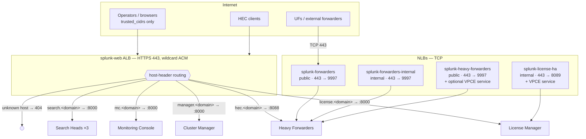
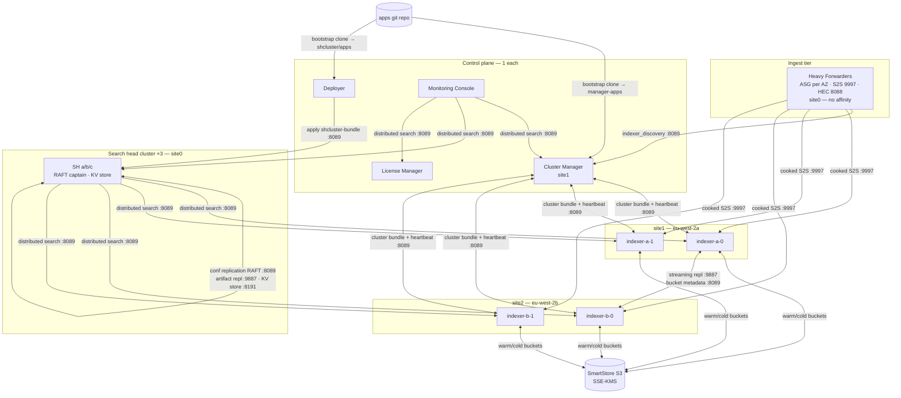

# Architecture

## Network / load balancing

One consolidated **`splunk-web` ALB** host-routes every HTTPS endpoint
(one ALB instead of four — ~$48/mo saved; one wildcard ACM cert).
TCP ingest paths stay on dedicated NLBs.

Unknown hostnames get a fixed 404 from the listener default action. Adding a
new web-facing role = one target group + one listener rule + one Route53
CNAME in `terraform/layers/cluster/splunk_web_alb.tf`.

## Splunk control plane & data flow

## Multisite layout

The prod indexer cluster is **multisite** (`multisite = true` in tfvars):

| Element | Site assignment |
| --- | --- |
| Indexers in eu-west-2a | `site1` |
| Indexers in eu-west-2b | `site2` |
| Cluster Manager | `site1` (its own AZ) |
| Search heads | `site0` — no search affinity, search both sites equally |
| Heavy forwarders | `site0` — indexer discovery returns peers from every site |

Policies (see [Configuration reference](configuration.md)):

- `site_replication_factor = origin:2,total:3` — each bucket keeps 2 copies
  in its origin site and 1 in the other, so an AZ loss never loses data.
- `site_search_factor = origin:1,total:2`.
- Legacy non-site buckets (bootstrapped from SmartStore, created before
  multisite) follow the single-site `replication_factor`; the CM sets
  `constrain_singlesite_buckets = false` so their copies can span sites
  (a 2-peer site can never hold RF=3 copies on its own).

The SHC is deliberately **not** tied to the indexer sites: 3 members across
3 AZs survive any single-AZ loss regardless of which sites the indexers use.

## Bootstrap behaviours

Key behaviours baked into the bootstrap templates
(`terraform/modules/splunk_instance/files/bootstrap/*.tpl`):

- **SHC captain bootstrap is deterministic**: the SH with the lowest
  InstanceId among running members waits for all peers' :8089 then runs
  `splunk bootstrap shcluster-captain`; dynamic (RAFT) election takes over
  from there. The KV store rides the SHC and elects its own captain.
- **Indexers join via `manager_uri`** in `server.conf` before first start —
  no manual join step. Index definitions + SmartStore config arrive via the
  CM's cluster bundle, never via bootstrap.
- **TLS certs are CA-issued at boot** by the cert-issuer Lambda; with
  `ssl_verify_server_cert = true` the bootstrap **fails closed** (exits, ASG
  replaces the instance) rather than fall back to self-signed. See
  [Security & TLS](security.md).
- Instances register their own private-zone DNS
  (`<host>.<env>.splunk.internal`) at boot.
- The **Monitoring Console self-configures**: a systemd timer runs a
  convergent reconciler (`mc-register-peers.sh`) that discovers peers from
  EC2 tags, adds/removes distributed-search peers, and flips the MC into
  distributed mode — surviving instance recycles without manual steps.

## Ports

| Port | What | Exposure |
| --- | --- | --- |
| 443  | ALB + NLB listeners | ALB: trusted_cidrs; NLBs as diagrammed |
| 8000 | Splunk Web | behind `splunk-web` ALB only |
| 8088 | HEC | behind ALB (`hec.<domain>`); VPC-internal direct |
| 8089 | splunkd management / REST | intra-cluster SGs + license NLB. Indexer↔indexer 8089 is **required** for SmartStore warm-bucket metadata replication (`CMSendMetadataJob`) |
| 9997 | S2S ingest | behind NLBs (listener 443 → 9997) |
| 9887 | replication (IDX hot-bucket streaming, SHC artifacts) | intra-cluster only |
| 8191 | KV store replication | SH ↔ SH only |

## Terraform layout

### Layers (apply in order)

- `terraform/layers/account` — VPC, subnets, KMS, S3 (resources / ma-certs /
  checkpoints / SmartStore), SG shells (incl. `splunk_web_alb`), PKI CA,
  cert-issuer Lambda, Route53 zones, CloudTrail, SNS slack + telegram alerts.
- `terraform/layers/iam` — per-role IAM roles/profiles + shared secrets
  (pass4SymmKey, admin password), GitHub OIDC roles for CI.
- `terraform/layers/cluster` — Splunk role ASGs, the `splunk-web` ALB +
  host rules (`splunk_web_alb.tf`), NLBs, Route53 records, CloudWatch alarms,
  SG rules, EventBridge → HEC event forwarding.

### Modules

- `terraform/modules/splunk_instance` — generic Splunk role ASG (bootstrap +
  server.conf templates selected by `role`; multisite + spot toggles;
  optional cache / checkpoint EBS). One ASG **per instance**
  (`desired_count` controls how many ASGs), so each instance has a stable
  identity (`prod_indexer_a_1`) and claims its own EBS volume by tag.
- `terraform/modules/cert_issuer` — internal-CA CSR-signing Lambda.
- `terraform/modules/s3_bucket_policy` — JSON policy generator.
- `terraform/modules/sns-slack-alert` — SNS → Lambda → Slack webhook.
- `terraform/modules/sns-telegram-alert` — second subscriber on the same
  ops-alert topic → Telegram bot (creds in `/monitoring/alerts/telegram`,
  JSON `{"bot_token","chat_id"}`; no-ops until populated).
