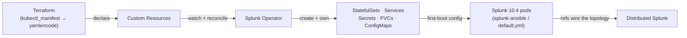
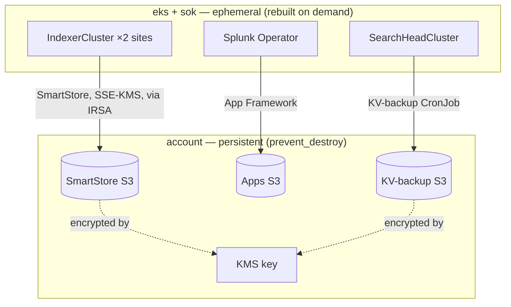
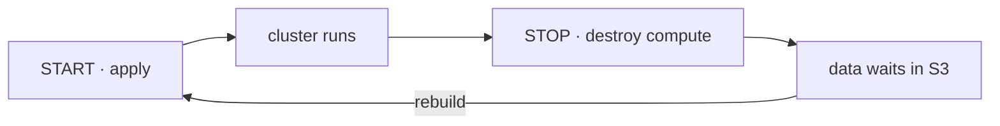

# Splunk Operator for Kubernetes (SOK) — overview

**A working-model reference: how the SOK build is put together and how we run it
day to day.** For the research and rationale behind the design, see the
[SOK design study](kubernetes-sok.md); for the phase-by-phase build, the
[implementation plan](kubernetes-sok-plan.md).

We don't install Splunk on these clusters — we *declare* the topology we want as
Kubernetes resources and let the Splunk Operator build it. And because the index
data lives in S3, the compute is disposable: dev tears itself down every night
and rebuilds from scratch.

## The operator model

SOK is a controller that runs inside the cluster. We author **Custom Resources
(CRs)** describing the Splunk topology; the operator reconciles the cluster
toward them — creating and owning the StatefulSets, Services, Secrets and
ConfigMaps, and rolling them when a CR changes.



The CRs we declare (in `terraform/layers/sok/crs.tf`):

| CR | Role |
|----|------|
| `ClusterManager` | The indexer-cluster brain; owns the SmartStore + multisite config pushed to peers |
| `IndexerCluster` (one per site) | The indexer peers, pinned to a site / AZ |
| `SearchHeadCluster` (prod) / `Standalone` (dev) | The search tier |
| `LicenseManager` | Licensing |
| `MonitoringConsole` | Cluster-wide monitoring |

CRs point at each other by reference (`clusterManagerRef`, `licenseManagerRef`,
`monitoringConsoleRef`) to form the distributed topology. The full annotated
CR skeleton (the M3 topology as multisite CRs, with the replication factors and
`constrain_singlesite_buckets` wiring) lives in the
[design study](kubernetes-sok.md#the-m3-topology-as-sok-custom-resources).

## The architecture — four Terraform layers

Everything is Terraform, split into layers that each hold their own state.

| Layer | Purpose | Lifecycle |
|-------|---------|-----------|
| `account` | VPC, S3 gateway endpoint (+ bucket allowlist), KMS, the SmartStore / apps / KV-backup S3 buckets (`prevent_destroy`), the HEC-token secret | **persistent** |
| `iam` | The CI (GitHub Actions) role & its policies | stable |
| `eks` | EKS 1.34 cluster, node groups, gp3 storage classes, node-local DNS | **ephemeral** |
| `sok` | Operator (Helm) + CRDs, all Splunk CRs, IRSA roles, defaults ConfigMaps, PDBs, KV-backup CronJob | **ephemeral** |

!!! note "The persistent / ephemeral split is the whole trick"
    The `account` layer holds the data (S3 + KMS) and is never torn down. `eks` +
    `sok` are pure compute — we destroy and rebuild them freely, because nothing
    there is precious. That is what lets dev rebuild nightly, and lets prod cut
    over without a data migration.

At runtime the ephemeral compute reaches the persistent data through IRSA (no
static keys), over the shared VPC's S3 gateway endpoint:



!!! warning "One live cluster manager per bucket"
    A SmartStore bucket may only ever have **one live cluster manager**. Keep a
    single active `sok` deployment pointed at a workspace's SmartStore bucket —
    never stand up a second cluster manager against the same data.

## Key mechanisms

| Mechanism | What it does |
|-----------|--------------|
| **SmartStore** | Index data in S3 (SSE-KMS); local disk is only a cache. Indexers are near-stateless — the reason the compute is disposable. |
| **IRSA** | Pods assume IAM roles through their ServiceAccounts to reach S3 and KMS. No static keys anywhere. |
| **App Framework** | Apps flow git → S3 → operator → pods: the cluster bundle to indexers, the deployer to the SHC. |
| **Multisite** | One `IndexerCluster` per site, pinned to its AZ by node-affinity; `origin:2, total:3` replication/search factors; the peer's `[general] site` is written explicitly. |
| **KV backup / restore** | A CronJob dumps the SHC KV store to S3 every 6h; restore targets the **KV-store captain** (which is *not* the SHC captain) and replicates out from there. |
| **Node-local DNS** | A per-node DNS cache that kills the intermittent `sts.<region>` resolution race that was starving IRSA of credentials. |
| **Config via `defaultsUrl`** | Editable config is staged in mounted ConfigMaps, not inline on the CR — an inline edit forces a full rolling restart. |

## How we run it

Three GitHub workflows drive the lifecycle. Start is `terraform apply`; stop is
`terraform destroy` of the compute only.

| Workflow | Trigger | What it does |
|----------|---------|--------------|
| **SOK START** | manual (dev \| prod) | Applies eks → sok: stands up EKS, the operator and the CRs, then bootstraps the topology (the persistent `account` layer is already in place). |
| **SOK STOP** | manual + nightly 21:30 UTC (dev) | Rolls hot buckets, destroys `sok` then `eks` (PVCs → EBS reclaimed in order); **keeps the `account` layer**. |
| **SOK CHECKS** | manual + auto after START | Verifies the cluster formed and is serving. |



!!! warning "Nightly auto-stop (dev)"
    Dev is destroyed every night at 21:30 UTC as a cost guard — ~$0 overnight,
    ~$1–2/mo at rest (just the persistent `account` KMS). Anything not in the
    `account` buckets does not survive the night.

Prod runs **always-on** — realistically **≈ $750/mo all-in** on the staged t3
shape (3× t3.xlarge ≈ $414 + EKS control plane $73 + gp3 PVCs ≈ $225 + NLBs
≈ $37; S3 rides the free VPC gateway endpoint, so no NAT and ~$0 SmartStore
transfer). Earlier "$490–570/mo" figures were wrong — they omitted the ~$225/mo
of EBS ([review NFR-9](reviews/non-functional.md)). Prod runs always-on because
it can't park without dropping live ingest.

**SOK has two rest states, not one.** Its nightly cost guard is a full
`terraform destroy` of the compute (`sok` + `eks`, control plane included), so
at rest it falls to the **destroyed floor ≈ $1–2/mo** (persistent `account`
S3 + KMS only). It does **not** sit on a "$73/mo parked" floor: that
control-plane charge only applies to the unvalidated *pause* model (nodes → 0,
cluster kept), which this build deliberately avoids. Any live EKS cluster bills
$73/mo standard, $438/mo in extended support after 2026-12-02, so the only cheap
rest state is total destroy. Sizing is deliberate, not an unknown: **prod stays
on the small t3 shape for now** — the current phase validates the *build-out
process* (lifecycle, rebuild determinism, DR mechanics), not performance. The
design's K7 performance profile (m6i.2xlarge indexers, compute alone past
$1,300/mo) is a separate, later decision taken against real ingest/search load.

## Accessing Splunk Web

Every Splunk service is `ClusterIP` (internal), so the default way in is a port
forward — no public surface:

```bash
make kubeconfig env=dev                                                   # point kubectl at the cluster
kubectl port-forward -n splunk svc/splunk-sh-standalone-service 8000:8000  # → http://localhost:8000
# login: admin   (NB: SOK's admin user is 'admin', not 'splunkadmin')
# dev password (env-scoped, SEC-1 — prod uses /monitoring/splunk/password):
aws secretsmanager get-secret-value --secret-id /dev/splunk/password --query SecretString --output text
```

### External access (Splunk Web via ALB) — opt-in, per component

When a port forward is impractical (a demo, a shared link), an **opt-in flag**
puts ONE internet-facing ALB (host-based routing) in front of the UI-serving
components you select, each getting a real HTTPS URL. It is **off by default**.

| Component | Hostname | Notes |
|-----------|----------|-------|
| `sh` | `sok_web_external_hostname` (e.g. `sok-dev.splunk.livehybrid.com`) | the search tier — Standalone or SHC by shape |
| `cm` / `lm` / `mc` | `<first-label>-<comp>.<zone>` (e.g. `sok-dev-cm.splunk.livehybrid.com`) | admin surfaces — keep the allow-list to operators |
| `deployer` | same pattern | SHC shapes only |
| **HEC** (`sok_hec_external_enabled`) | `<first-label>-hec.<zone>` | data ingest, not a UI — own flag, routes :443 → indexer HTTPS :8088 |
| indexers (web) | — | **never exposable** (splunkweb is disabled on peers) |
| DS | — | no Deployment Server CRD exists under SOK |

Adding/removing a component only edits ALB rules + DNS — **no pod restarts**
(the proxy web.conf rides every UI CR whenever the flag is on).

**Where to configure it** — `terraform/layers/_shared/vars/<env>.tfvars` (knobs
defined in `_shared/variables.tf`, wired in `terraform/layers/sok/web-ingress.tf`):

| Variable | Purpose |
|----------|---------|
| `sok_web_external_enabled` | `true` creates the ALB Ingress + Route53 CNAMEs. Default `false`. |
| `sok_web_external_components` | Which UIs ride the ALB (default `["sh"]`). |
| `sok_web_external_hostname` | FQDN for the `sh` URL; the other components derive `<first-label>-<comp>.<zone>`. **All must be covered by the ACM cert** — a `*.<zone>` wildcard covers exactly one label, which the derived names respect. |
| `sok_web_external_zone_name` | Route53 public zone that owns the records, e.g. `splunk.livehybrid.com`. Also used to auto-discover the `*.<zone>` ACM cert. |
| `sok_web_external_allowed_cidrs` | Inbound allow-list on the ALB (applies to every component). **Empty ⇒ `trusted_cidrs`.** Set `["0.0.0.0/0"]` to open it to everyone. |
| `sok_web_external_certificate_arn` | Optional explicit ACM cert ARN (else the `*.<zone>` cert is discovered). |

**Enable / disable:**

```bash
# enable (or change scope): edit <env>.tfvars, then re-apply the sok layer
make -C terraform/layers/sok -f ../_shared/Makefile terraform env=dev args=-auto-approve
# disable / tear the ALB down: set sok_web_external_enabled=false, re-apply (removes the Ingress + CNAME)
```

Requires the AWS Load Balancer Controller (installed by the eks layer). The shared
prod subnets carry no `kubernetes.io/role/elb` tag (tagging them would perturb the
prod estate's own LB discovery), so the public subnets are passed to the controller
explicitly. The ALB is provisioned *after* the Ingress, so its DNS name is unknown
at apply time — the Ingress is declared as a `kubernetes_manifest` resource with a
`wait { fields }` block on `status.loadBalancer.ingress[0].hostname`, so Terraform
blocks until the controller has assigned the ALB hostname. That hostname then
feeds native `aws_route53_record` resources (the CNAMEs), which Terraform creates
and destroys with the rest of the layer — no `null_resource`, no local-exec, no
poll script.

When the flag is on, every UI-serving CR's `web.conf` gets `tools.proxy.on = true`
and `tools.proxy.local = Host` so Splunk emits `https://` redirects on the external
hostname. Without them Splunk (which sees plain HTTP on `:8000` behind the
TLS-terminating ALB) 303s the browser to `http://…` and — on the login redirect —
to `https://127.0.0.1:8000/…`; the ALB doesn't send `X-Forwarded-Host`, so Splunk
has to read the preserved `Host` header (`local = Host`) to keep the external name.
Scoped to the flag (one restart per component when first enabled); port-forward
keeps working either way.

!!! danger "This exposes admin surface — scope it and tear it down"
    Dev's admin login is env-scoped (`/dev/splunk/password`, SEC-1), so an
    exposed dev UI no longer holds prod credentials — but it is still full admin
    on the cluster. Keep `sok_web_external_allowed_cidrs` as narrow as the
    audience allows (the default is your `trusted_cidrs` only) and disable the flag
    the moment you're done. Never leave a `0.0.0.0/0` admin UI up.

!!! note "Is ALB-fronting HEC supported? Yes — the 'Classic-ELB-only' rule is history"
    HEC is plain HTTPS, so an ALB is a supported front door. The old rule came
    from **Kinesis Data Firehose**, which was Classic-ELB-only until AWS
    [added ALB support in Jan 2024](https://aws.amazon.com/about-aws/whats-new/2024/01/amazon-kinesis-data-firehose-data-splunk-alb/).
    Current caveats, all encoded here: (1) tokens with **`useACK` need sticky
    sessions** (ack polls must reach the receiving indexer) — the HEC target
    group sets a 7-day `lb_cookie`, per [Splunk's ELB guidance](https://docs.splunk.com/Documentation/AddOns/released/Firehose/ConfigureanELB);
    (2) **NLB is *not* supported for Firehose→HEC**; (3) Firehose requires a
    **CA-signed cert matching the DNS name** — exactly what the ALB + ACM
    wildcard provide (raw :8088 presents Splunk's self-signed cert and would be
    rejected). S2S (:9997) is a different story — proprietary TCP, NLB-only,
    not an ALB candidate.

!!! warning "No stable URL across nightly rebuilds"
    The ALB lives in the nightly-destroyed `sok` layer, so each rebuild mints a
    **new** ALB and the CNAME is re-pointed by the next apply's
    `aws_route53_record`. For a URL that survives rebuilds, add the
    **external-dns** addon (follow-up).
